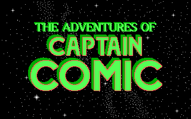

# Captain Comic Modernization

A modern recreation of the classic 1988 DOS game *The Adventures of Captain Comic* using SDL2 and C++.



## Project Status

**Current Phase:** Polish and Testing (Phase 9 - In Progress)

- [x] Foundation complete (SDL2 setup, build system, basic game loop)  
- [x] Core physics complete (gravity, jumping, collision, stage transitions)  
- [x] Rendering system complete (tiles, sprites, animations, camera)  
- [x] Level system complete (all 8 levels, doors, stage transitions)  
- [x] Actor system complete (enemies, fireballs, items)  
- [x] Audio system complete (SFX + music)  
- [x] UI/Menus complete (title sequence, HUD, menus, animations)  
- [x] Game loop integration complete (Phase 8)  
- [ ] Polish and testing in progress (Phase 9)
- [ ] Release preparation and packaging (Phase 10)

## About

This project ports the game to modern systems while maintaining behavioral fidelity to the original. We're using the [C refactor by jsandas](https://github.com/jsandas/comic-c) as the primary reference, which provides well-structured game logic translated from the original x86-16 assembly.

**Technology Stack:**
- **SDL2** - Graphics, audio, and input
- **C++17** - Modern language features
- **CMake** - Cross-platform builds

**Target Platforms:**
- Windows
- macOS
- Linux

## Building

### Prerequisites

**Required:**
- CMake 3.16+
- C++17 compiler (GCC 7+, Clang 5+, MSVC 2017+)
- SDL2 development libraries (SDL2, SDL2_image, SDL2_ttf, SDL2_mixer)
- Original game files (https://archive.org/download/TheAdventuresOfCaptainComic/AdventuresOfCaptainComicEpisode1The-PlanetOfDeathR5sw1991michaelA.Denioaction.zip)

### Assets

The build requires the original DOS game data to extract graphics, maps,
sprites and sounds.  Revision 5 of *Captain Comic* is used by the
`tools/extract_assets.py` script, which places the converted PNGs into
`assets/` subfolders.

1. Download the ZIP archive from Archive.org and unpack it into the
   `original/` directory (the script will look there):

```bash
curl -L -o comic_r5.zip \
  https://archive.org/download/TheAdventuresOfCaptainComic/AdventuresOfCaptainComicEpisode1The-PlanetOfDeathR5sw1991michaelA.Denioaction.zip
unzip comic_r5.zip -d original
rm comic_r5.zip
```

2. Install the Python dependencies and run the extractor:

```bash
pip install -r tools/requirements.txt
python3 tools/extract_assets.py --orig original
```

After extraction the `assets/` folder will contain neatly categorized
subdirectories (`sprites`, `tiles`, `maps`, `shp`, `sounds`, etc.) that
are referenced by the C++ code.

### Running Precompiled Binaries

Release archives include the game executable and asset extraction tools, but
do not include copyrighted game assets. To run a precompiled release, install
the required runtime libraries for your platform, extract assets from original
game files, then launch the executable.

**Runtime dependencies by platform:**

- **macOS (Homebrew):**

```bash
brew install sdl2 sdl2_image sdl2_ttf sdl2_mixer python
```

- **Ubuntu/Debian Linux:**

```bash
sudo apt-get update
sudo apt-get install -y libsdl2-2.0-0 libsdl2-image-2.0-0 libsdl2-ttf-2.0-0 libsdl2-mixer-2.0-0 python3 python3-pip
```

- **Windows:**
  - The release binary is built with static SDL linkage.
  - Install Python 3 (for asset extraction tooling): https://www.python.org/downloads/windows/

**From inside the extracted release folder:**

1. Download and unpack the original game files into an `original/` directory.
2. Install Python dependencies:

```bash
pip install -r tools/requirements.txt
```

3. Extract assets:

```bash
python3 tools/extract_assets.py --orig original
```

4. Run the game:
   - macOS/Linux: `./captain_comic`
   - Windows: `.\captain_comic.exe`

### macOS

```bash
# Install SDL2
brew install sdl2 sdl2_image sdl2_ttf sdl2_mixer

# Build (recommended: CMake preset)
cmake --preset default
cmake --build --preset build-default

# Run
./build/captain_comic
```

Manual fallback:

```bash
mkdir build && cd build
cmake ..
make
./captain_comic
```

### Linux

```bash
# Install SDL2 (Ubuntu/Debian)
sudo apt-get install cmake g++ libsdl2-dev libsdl2-image-dev libsdl2-ttf-dev libsdl2-mixer-dev

# Or Fedora
sudo dnf install cmake gcc-c++ sdl2-compat-devel SDL2_image-devel SDL2_ttf-devel SDL2_mixer-devel

# Build
mkdir build && cd build
cmake ..
make

# Run
./captain_comic
```

### Windows

```bash
vcpkg install sdl2 sdl2-image sdl2-ttf sdl2-mixer

# Build with Visual Studio or MinGW
mkdir build && cd build
cmake ..
cmake --build .

# Run
.\captain_comic.exe
```

## Current Features

- [x] SDL2 window and event loop
- [x] Keyboard input handling (arrow keys, space, Ctrl to fire)
- [x] Complete physics system:
  - [x] Gravity and terminal velocity
  - [x] Jumping with original constants (GRAVITY=5, ACCELERATION=7)
  - [x] Ceiling, floor, and wall collision detection
  - [x] Mid-air momentum and drag
  - [x] Stage boundary transitions (left/right edge)
  - [x] Camera following with viewport scrolling
- [x] Full rendering system:
  - [x] Tile rendering from converted PNG tilesets (all 8 levels)
  - [x] Player sprite with idle, run (3-frame), and jump animations
  - [x] Direction-aware sprite rendering (left/right facing)
  - [x] Enemy sprite rendering with GIF-based animation (loop and ping-pong)
  - [x] Fireball rendering (2-frame animated sprites)
  - [x] Hardware-accelerated (SDL2 renderer)
- [x] Level system:
  - [x] All 8 levels (LAKE, FOREST, SPACE, BASE, CAVE, SHED, CASTLE, COMP)
  - [x] 3 stages per level with complete tile, door, and enemy data
  - [x] Door system with key requirement and level/stage transitions
  - [x] Stage transitions at left/right boundaries
- [x] Enemy system (Actor System):
  - [x] All 5 AI behaviors: Bounce, Leap, Roll, Seek, Shy
  - [x] Enemy spawning, despawning, and respawn cycling
  - [x] Enemy-player collision (damage trigger)
  - [x] Death animations: white spark (killed by fireball), red spark (hit player)
- [x] Fireball system:
  - [x] Up to 5 simultaneous fireballs (based on Blastola Cola count)
  - [x] Horizontal movement (±2 units/tick) in facing direction
  - [x] Corkscrew motion when Corkscrew item is held
  - [x] Fireball-enemy collision detection and kill
  - [x] Fireball meter with 2-tick charge/discharge rate
- [x] Item system:
  - [x] Item placement and rendering (16×16 px, 2-frame animation)
  - [x] Collision detection and collection
  - [x] Blastola Cola: increase firepower (max 5)
  - [x] Corkscrew: fireball vertical oscillation
  - [x] Boots: increased jump power (4→5)
  - [x] Lantern: castle lighting flag
  - [x] Shield: HP refill (placeholder)
  - [x] Door Key: unlock doors
  - [x] Teleport Wand: special teleport ability
  - [x] Treasures (Gems, Crown, Gold): victory tracking
- [x] Audio system:
  - [x] PC-speaker-style square-wave SFX synthesis (SDL2_mixer)
  - [x] Single-channel priority SFX system (higher priority interrupts lower)
  - [x] 10 sound effects: fire, item collect, door open, stage transition, enemy hit, player hit, player die, game over, teleport
  - [x] Title music with full looping (100-note melody)
  - [x] Dedicated music channel independent from SFX
- [x] Title sequence:
  - [x] Title screen (SYS000.EGA) with 6-step palette fade-in
  - [x] Story screen (SYS001.EGA) and items/controls screen (SYS004.EGA)
  - [x] Title music playback during sequence
  - [x] Letterbox rendering for 320×200 EGA content
  - [x] `--skip-title` flag to bypass sequence during development
- [x] HUD/UI system:
  - [x] Score display (6-digit base-100 encoding)
  - [x] Lives counter (0-5 icons, bright/dark states)
  - [x] HP meter (6 cells)
  - [x] Fireball meter (6 cells, full/half/empty states)
  - [x] Full inventory grid (9 items, 3×3 layout, 2-frame animation)
  - [x] Menus: pause, high scores, keyboard setup, startup notice
  - [x] Beam-in/beam-out, death, and victory animations
- [x] **Debug/Cheat System** (development tool, `--debug` flag required):
  - [x] Noclip mode (F1)
  - [x] Level/stage warp (F2)
  - [x] Debug overlay — coordinates, velocity, level/stage (F3)
  - [x] Position warp (F4)
  - [x] Item granting (F5) — grant any item for testing effects

## Roadmap

See [MODERNIZATION_PLAN.md](docs/MODERNIZATION_PLAN.md) for the complete 10-phase implementation plan:

- [x] Phase 1: Foundation and SDL2 setup
- [x] Phase 2: Core physics and player movement
- [x] Phase 3: Rendering system and camera
- [x] Phase 4: Level loading and stage transitions
- [x] Phase 5: Actor system, enemies, and items
- [x] Phase 6: Audio system and music
- [x] Phase 7: UI, menus, and title sequence
- [x] Phase 8: Full game loop integration
- [ ] Phase 9: Polish and testing
- [ ] Phase 10: Release preparation and packaging

## Project Structure

```
comic-modernization/
├── CMakeLists.txt              # Build configuration
├── README.md                   # This file
├── docs/                       # Project documentation and roadmap
├── include/                    # Header files
├── src/                        # Game source
├── tests/                      # Test suite
├── tools/                      # Development tools
├── original/                   # Original game assets (local)
├── assets/                     # Modernized assets (in progress)
└── build/                      # Build output (generated)
```

## Controls

- **Arrow Keys** - Move left/right
- **Space** - Jump
- **Left/Right Ctrl** - Fire fireball
- **Alt** - Open doors

### Debug Mode (with `--debug` flag)

- **F1** - Toggle noclip (walk through walls)
- **F2** - Level warp (interactive menu to select level 0-7 and stage 0-2)
- **F3** - Toggle debug overlay (shows X/Y coordinates, velocity, level/stage)
- **F4** - Position warp (teleport to specific coordinates)
- **F5** - Grant item (select any item to test effects: Blastola Cola, Boots, Corkscrew, etc.)

## Development

### Reference Materials

- [jsandas/comic-c](https://github.com/jsandas/comic-c) - Primary reference (C refactor)
- Assembly disassembly - For low-level details and validation

### Workflow

1. Port logic from C refactor reference
2. Validate physics constants (GRAVITY=5, ACCELERATION=7, etc.)
3. Test behavior against original (DOSBox)
4. Commit working increments

### Testing

Automated unit tests cover physics, actors, items, UI helpers, and audio. Run with:

```bash
cd build && ctest --output-on-failure
```

### CMake Presets

This repository includes `CMakePresets.json` for reproducible local configuration.

- `default` - Standard debug configure without clang-tidy
- `clang-tidy-intel` - Enables clang-tidy and prepends `/usr/local/opt/llvm/bin` to PATH
- `clang-tidy-apple-silicon` - Enables clang-tidy and prepends `/opt/homebrew/opt/llvm/bin` to PATH

Configure and build with presets:

```bash
cmake --preset default
cmake --build --preset build-default
```

### Static Analysis (clang-tidy)

The repository includes a root `.clang-tidy` configuration tuned for this codebase.

Enable clang-tidy using the preset that matches your Homebrew layout:

```bash
cmake --preset clang-tidy-intel
cmake --build --preset build-clang-tidy-intel
```

or

```bash
cmake --preset clang-tidy-apple-silicon
cmake --build --preset build-clang-tidy-apple-silicon
```

If clang-tidy is not installed or not present in the preset PATH, CMake will fail with a clear error.

### Tools

Generate compiled-in tile data from the original PT files:

```bash
g++ -std=c++17 -o tools/generate_tiles tools/generate_tiles.cpp
./tools/generate_tiles            # Run from repo root
./tools/generate_tiles /path/to/comic-modernization
```

The tool expects the original data in the `original/` directory and writes
`src/level_tiles.cpp`.

## Contributing

This is an active development project. Contributions welcome once core systems are complete.

### How to Help

- Test builds on different platforms
- Report bugs and issues
- Suggest improvements (after MVP)
- Documentation improvements

## License

Code: TBD (likely MIT or GPL)  
Assets: Original game assets © Michael Denio - consult original licensing

## Credits

- **Original Game**: Michael Denio (1988)
- **C Refactor**: [jsandas/comic-c](https://github.com/jsandas/comic-c)
- **Modernization**: This project's contributors

## Links

- Original Game: [Wikipedia](https://en.wikipedia.org/wiki/The_Adventures_of_Captain_Comic)
- C Refactor: [github.com/jsandas/comic-c](https://github.com/jsandas/comic-c)
- SDL2: [libsdl.org](https://www.libsdl.org/)

---

**Last Updated:** 2026-04-26  
**Status:** Active Development (Phase 9 of 10)